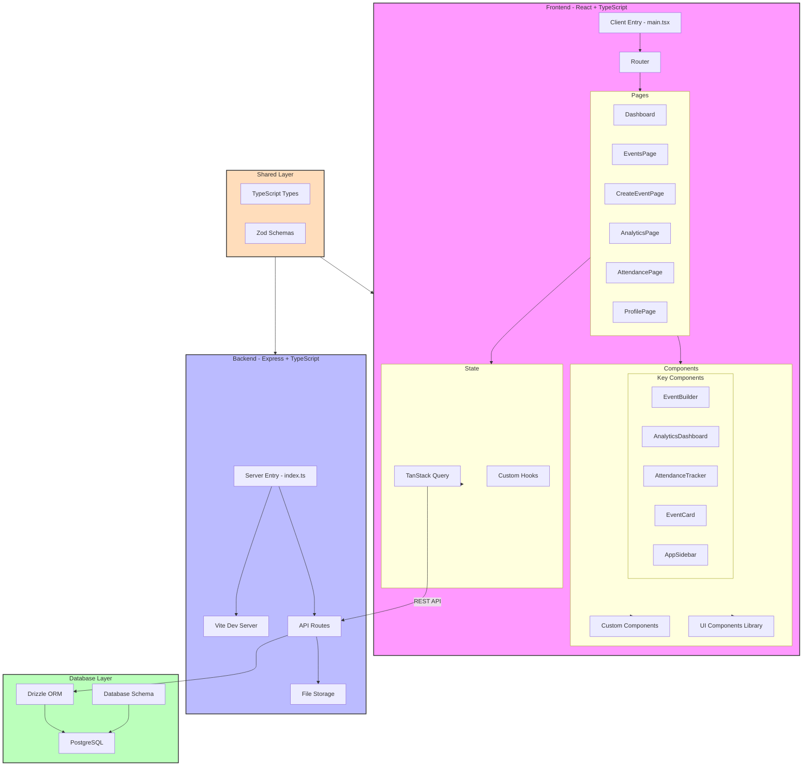

# EventHorizon Architecture

## Architecture Components

### Frontend Layer
- **Client**: React-based SPA using TypeScript
- **Routing**: Wouter for lightweight routing
- **State Management**: TanStack Query for server state
- **UI Components**: 
  - Shadcn UI components
  - Custom components for specific features
- **Key Features**:
  - Drag-and-drop event builder
  - Analytics dashboard with charts
  - Attendance tracking
  - Event management

### Backend Layer
- **Server**: Express.js with TypeScript
- **Development**: Vite for dev server and building
- **File Handling**: Storage utilities for file uploads
- **API Routes**: RESTful endpoints for:
  - User management
  - Event operations
  - Analytics
  - Attendance

### Database Layer
- **ORM**: Drizzle for type-safe database operations
- **Database**: PostgreSQL
- **Schema**: 
  - Users
  - Events
  - Attendance records
  - Analytics data

### Shared Layer
- **Types**: Shared TypeScript interfaces
- **Validation**: Zod schemas for data validation
- **Constants**: Shared configuration and constants

## Key Technologies
- TypeScript
- React
- Express.js
- PostgreSQL
- Drizzle ORM
- TanStack Query
- Shadcn UI
- Recharts
- Tailwind CSS

## Development Architecture
- **Development Server**: Vite
- **Build System**: 
  - Vite for frontend
  - esbuild for backend
- **Type Checking**: TypeScript
- **Package Management**: npm
- **Environment**: Node.js

## Security Layer
- User authentication
- Password hashing
- Session management
- Input validation using Zod

## Deployment Architecture
- **Production Build**:
  - Frontend: Static assets
  - Backend: Node.js server
  - Database: PostgreSQL instance
- **Environment Variables**:
  - Database configuration
  - Server settings
  - API keys